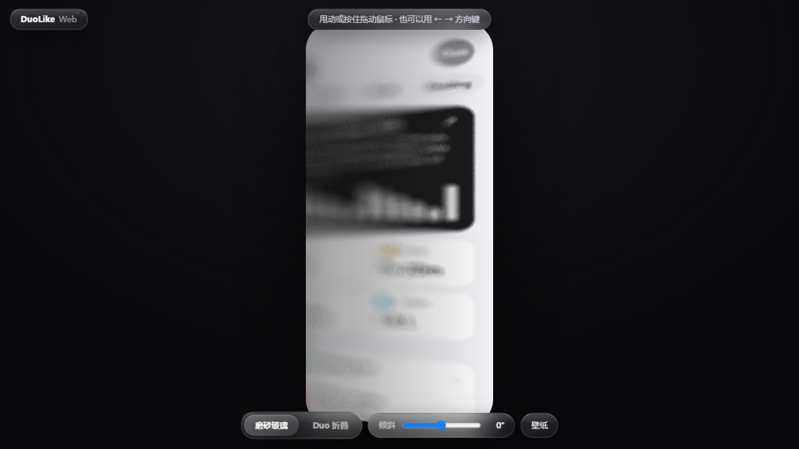
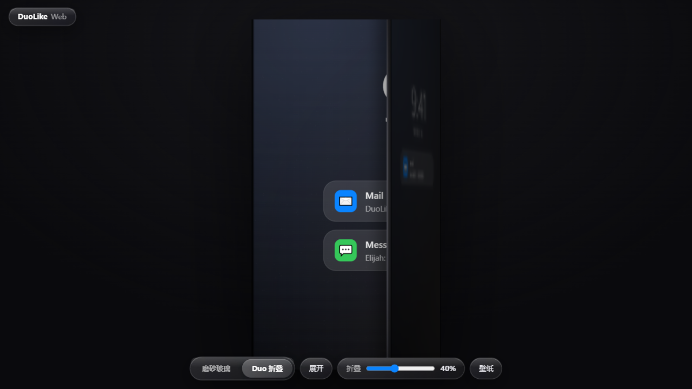
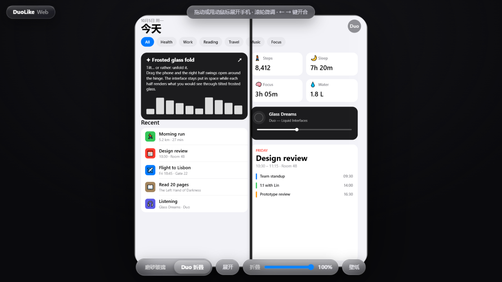

# DuoLike Web — iPhone Duo 折叠动画 · 跨平台 WebGL 移植版

> **⚠️ 半成品 / Work in Progress** — 项目仍在快速迭代，动效、交互和纹理随时会改，已知有若干待打磨的细节。
> **Still a work in progress**: under active iteration — animations, interactions and textures may change at any time.

Cross-platform WebGL2 port of [DuoLikeAnimation](https://github.com/elijah-semyonov/DuoLikeAnimation) —
the frosted-glass "fold" effect that mimics the iPhone Duo's folding animation, rebuilt so it runs
on **Android phones, Windows / macOS / Linux desktops and iPhones** from one zero-build static page.

Two modes in one page:

1. **磨砂玻璃 / Frosted glass** — the faithful port of the original: tilt the phone and the screen
   becomes a pane of frosted glass while the interface stays put in space.
2. **Duo 折叠 / Book fold** — a new mode built on the same math: an iPhone-Duo-style foldable you
   can **drag / swipe to unfold like a book**, with hinge shadow, a specular sweep across the
   bending glass and a liquid-glass cover screen on the outside. The page UI itself is styled
   after iPhone **Liquid Glass**.

> 原理与原版完全一致:界面被视作空间中固定的平面,屏幕则变成一块倾斜的磨砂玻璃 ——
> 倾斜或开合手机时,界面留在原地,屏幕渲染的是"透过一扇倾斜的毛玻璃窗"看到的内容:
> 按透视重新投影、按间隙模糊与压暗,视线完全错过界面处为黑色。

<p align="center">
  
  
  
</p>

## 平台与输入方式 / Platforms & input

| 平台 | 磨砂玻璃模式 | Duo 折叠模式 |
| --- | --- | --- |
| **Android / iOS 手机** | 真实体感倾斜(`deviceorientation` 姿态解算 + 陀螺仪预测) | 左右滑动屏幕开合,弹簧铰链带回弹 |
| **Windows / macOS / Linux** | 没有加速度计 —— 鼠标**甩动**触发晃动、按住拖动保持倾斜、`←` `→`、滑杆 | 拖动展开/合上；轻放像阻尼铰链一样**停在当前角度**，快速甩动才弹开或弹合；滚轮微调、`←` `→` |

两个模式通用:手动滑杆、"校准"归零(体感模式)、自定义壁纸、液态玻璃分段控制切换模式。

## 运行 / Run

零构建、零依赖的纯静态页面:

```bash
# any static server works, e.g.
python -m http.server 8000
# then open http://localhost:8000  (HTTPS or localhost is required for motion sensors)
```

或直接部署到 GitHub Pages。手机上体感必须通过 **HTTPS 或 localhost** 访问(浏览器安全要求)。

开发调试可用 `python devserver.py`(带 no-cache 响应头)。

## 实现 / How it works

| File | Role |
| --- | --- |
| `js/fold.js` | 两个着色器:`DuoFold.metal` 的 1:1 GLSL ES 移植(铰链重投影、Vogel 盘模糊、压暗、颗粒);以及 Duo 模式的书本折叠光线投射着色器(折叠半屏与底半屏分别求交、按深度合成,逐角圆角 SDF、铰链投影阴影、高光扫过、mipmap 抗缩水纹) |
| `js/motion.js` | `FoldMotionModel.swift` 的移植:姿态矩阵相对校准零位解算屏幕 Y 轴倾角 + 陀螺仪预测 + 0.7/样本平滑;桌面端倾斜为弹簧物理(甩动冲量/拖拽/键盘);`FoldController` 负责折叠开合的弹簧铰链物理 |
| `js/ui.js` | Canvas2D 绘制三块界面:原版演示屏(390×844)、展开态双栏内屏(780×844,栏间距避开铰链)、液态玻璃外屏封面(390×844)+ 自定义壁纸 |
| `js/main.js` | 模式切换、尺寸/DPR、纹理上传、液态玻璃控制面板、渲染循环 |

物理参数与原版相同:视距 320 mm × 6 pt/mm = 1920 pt、`blurSpread` 0.12、`darkening` 0.015
(见 `FoldEffect.swift` 与 `DEFAULT_PARAMETERS`)。Duo 折叠模式里相机随手机视觉中心平移,
保证任意开合角度下机身都居中。

页面暴露了调试/截图钩子:`__setTiltDeg(n)` / `__clearTilt()` / `__setFold01(v)` / `__clearFold()`。

## 与原版的差异 / Differences from the original

- 原版仅 iOS(SwiftUI + Metal + Core Motion);本版用 WebGL2,磨砂玻璃着色器数学逐行对应移植。
- Duo 折叠模式、外屏封面、液态玻璃 UI 为本项目的扩展,着色器沿用同一套"固定平面 + 光线投射"模型。
- 桌面端没有倾斜传感器(Windows 台式机/多数笔记本无加速度计),交互改为鼠标甩动/拖拽/键盘 ——
  原版在不带传感器的 Simulator 上也是手动滑杆,思路一致。
- 横屏轴向映射按原版 `screenAxesInDeviceSpace()` 表格移植,若个别机型横屏方向相反,竖屏使用不受影响。

## 致谢 / Credits

Algorithm & original iOS implementation: **[DuoLikeAnimation](https://github.com/elijah-semyonov/DuoLikeAnimation)**
by [Elijah Semyonov](https://github.com/elijah-semyonov), MIT License.
This project is a WebGL port of that work, distributed under MIT as well — see [LICENSE](LICENSE).

## License

MIT — see [LICENSE](LICENSE). Contains portions from DuoLikeAnimation © 2026 Elijah Semyonov.
